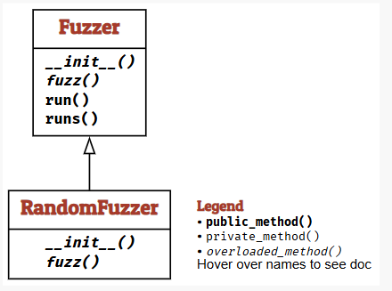
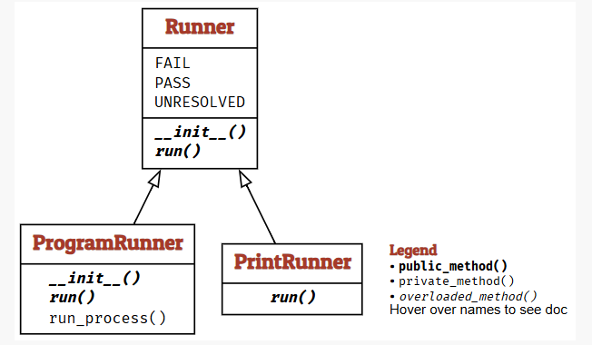

## Overview

## Summary

### What is Fuzzing?
#### Fuzzers
`Fuzzer` is a base class for fuzzers, with `RandomFuzzer` as a simple instantiation. The `fuzz()` method of `Fuzzer` objects and returns a string with a generated input.

```python
>>> random_fuzzer = RandomFuzzer()
>>> random_fuzzer.fuzz()
```

Output: `%$<1&<%+=!"83?+)9:++9138 42/ "7;0-,)06 "1(2;6>?99$%7!!*#96=>2&-/(5*)=$;0$$+;<12"?30&`

The `RandomFuzzer` constructor allows a number of keyword arguments:

```python
>>> print(RandomFuzzer.__init__.__doc__)
```

Output: Produce strings of `min_length` to `max_length` characters in the range [`char_start`, `char_start` + `char_range`)

```python
>>> random_fuzzer = RandomFuzzer(min_length=10, max_length=20, char_start=65, char_range=26)
>>> random_fuzzer.fuzz()
```

Output: `'XGZVDDPZOOW'`



#### Runners
A `Fuzzer` can be paired with a `Runner` which takes the fuzzed strings as input. Its result is a class-specific *status* and an *outcome* (`PASS`, `FAIL`, or `UNRESOLVED`). A `PrintRunner` will simply print out the given input and return a `PASS` outcome:

```python
>>> print_runner = PrintRunner()
>>> random_fuzzer.run(print_runner)
```

Outcome: `('EQYGAXPTVPJGTYHXFJ', 'UNRESOLVED')`

A `ProgramRunner` will feed the generated input into an external program. Its result is a pair of the program status (a `CompletedProcess` instance) and an *outcome* (`PASS`, `FAIL` or `UNRESOLVED`):

```python
>>> cat = ProgramRunner('cat')
>>> random_fuzzer.run(cat)
```

Outcome: `(CompletedProcess(args='cat', returncode=0, stdout='BZOQTXFBTEOVYX', stderr=''),
 'PASS')`

 

 ### A Testing Assignment

 