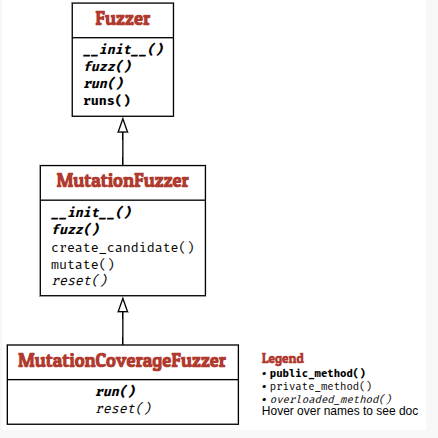

## Overview
Overview of Mutation-Based Fuzzing

## Summary

### The Limitation of Random Generation

### What Is Mutational Fuzzing?

### Fuzzing a URL Parser

### Primary Mutation Operators

### Mutating URLs in Practice

### Stacking Multiple Mutations

### Guiding Mutations with Coverage

When mutating inputs blindly, many mutations quickly make an input syntactically invalid, causing the target program to reject it immediately. As a result, blind mutational fuzzing eventually gets stuck. To solve this, coverage-guided fuzzing (pioneered by tools like American Fuzzy Lop / AFL) uses feedback from code execution to guide the mutation process:

* Population/Seed Corpus: The fuzzer maintains a pool (population) of interesting inputs, initialized with one or more valid sample inputs (seeds).

* Execution & Instrumentation: The fuzzer executes the target program with a mutated candidate input and measures which code locations (statements or branches) were executed (using coverage tracking/instrumentation).

* Feedback Loop: If a mutated candidate covers new code (i.e., reaches new statements or branches not seen before in the cumulative coverage set), the candidate is considered valuable. This candidate is then added to the population of inputs.

* Evolutionary Search: By continually picking inputs from the updated population and mutating them further, the fuzzer gradually "learns" how to bypass complex parsing checks, reach deeper execution paths, and maximize overall code coverage without needing a formal input grammar.

### The MutationFuzzer Architecture

The chapter structures the mutational fuzzing framework using an object-oriented design in Python that builds upon a base Fuzzer hierarchy:

Mutation Operators: Basic helpers (delete, insert, bit-flip) that perform random character or bit modifications on input strings.

MutationFuzzer: Takes initial valid seeds, randomly picks one, applies $N$ mutations, and returns a new candidate input.

MutationCoverageFuzzer: Extends the basic fuzzer with an evolutionary loop—it tracks executed code lines and adds any mutated input that reaches new coverage back into the active seed pool.

### Key Lessons

A few important takeaways from the mutation-based fuzzing chapter:

* Mutation-based fuzzing generates new inputs by applying small changes to existing, valid seed inputs.
* Valid seeds allow fuzzers to bypass basic parsing logic and reach deep, complex code paths without needing a full input grammar.
* Coverage tracking acts as an evolutionary guide, helping the fuzzer identify which mutations explore new territory.
* Adding high-coverage inputs back into the seed pool creates a feedback loop that continuously improves test generation.
* Hybrid techniques like mutation-based fuzzing offer a practical balance between low-effort setup and high code reach.

### Quiz Check

### Q1. What is the primary advantage of mutation-based fuzzing over purely random fuzzing?

* [ ] It guarantees 100% code coverage on the first execution run.

* [ ] It leverages valid seed inputs to stay close to syntactically correct structure and reach deeper code paths.

* [ ] It eliminates the need to execute or instrument the target program.

* [ ] It automatically fixes any buffer overflow bugs it finds in the source code.

Click to Expand for the Answer

**Answer!**
It leverages valid seed inputs to stay close to syntactically correct structure and reach deeper code paths.

### Q2. How does coverage-guided fuzzing use the seed population?

* [ ] It replaces the entire seed population with randomly generated strings every 10 seconds.

* [ ] It deletes seed inputs whenever they fail to trigger an immediate crash or error.

* [ ] It dynamically adds mutated inputs to the seed population whenever they discover new code execution paths.

* [ ] It keeps the initial seed population fixed and never modifies or expands it during execution.

Click to Expand for the Answer

**Answer!**
It dynamically adds mutated inputs to the seed population whenever they discover new code execution paths.

::: {.callout-note appearance="minimal" title="Mutation-based fuzzing" collapse="false"}

Mutation-based fuzzing is not a magic bullet—it can still get stuck on strict multi-byte checks or complex validations without assistance like dictionaries or symbolic execution. However, when combined with coverage feedback, mutation fuzzing provides an efficient, automated method for surfacing hidden edge cases and vulnerabilities in software.

:::

::: {.callout-note appearance="minimal" title="Open-Source Tool for Software Engineers" collapse="false"}

Our team built `Fizzbuzz`, a command-line program that shows code coverage in
action. You can view the project here: [Fizzbuzz on
GitHub](https://github.com/Abishek-D-7/Fizzbuzz).

:::

<!-- Include the license statement for the online book -->


<!-- Include reference back to the listing of blog posts -->

