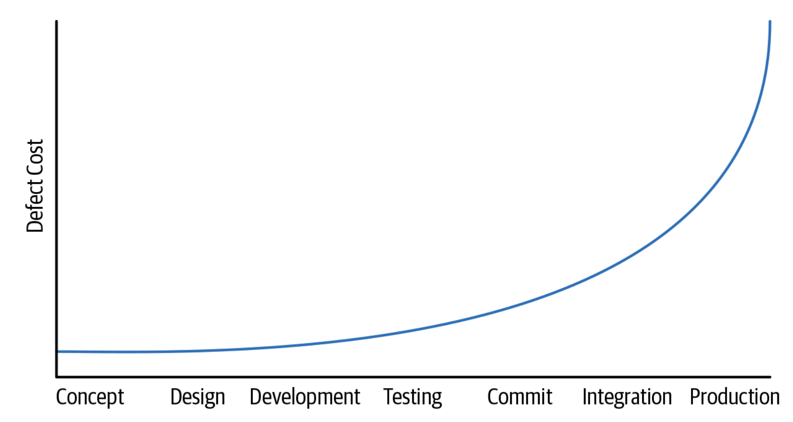

## Summary

Software engineering is different from programming because it focuses on more
than just writing code. It considers time, scale, and the decisions involved in
maintaining software. While a program might only need to work temporarily,
software engineering focuses on creating systems that can continue to work and
adapt over time. Sustainability is an important part of software engineering.
Software should be able to change when technology, security issues, or user
needs change. Engineers must also consider teamwork, organization, and
maintaining projects as they grow.

## Further Explorations

The reading introduces Hyrum's Law, which explains that users may depend on
behaviors in a system even if those behaviors were never officially promised.
Because of this, even small changes can unexpectedly cause problems. The
reading also highlights the difference between code that simply works and code
that is maintainable. Good software engineering requires developers to think
about how their code may need to change in the future.

### Time and Change

Time plays a major role in software engineering. Short programs may only be
used once, but long-term projects need regular updates and maintenance. As
technology changes, software must be able to adapt. Instead of avoiding changes
because they are difficult, engineers should design software in a way that
makes future updates easier. Sustainable software is not software that never
changes, but software that can change when needed. [See the graph showing how
software changes over
time](https://abseil.io/resources/swe-book/html/images/seag_0101.png)

### Scale and Efficiency

The first main topic is about how software and engineering processes should
work when a company, team, or codebase becomes much bigger. A system is not
really scalable if every time the project grows, engineers have to spend much
more time and effort doing the same tasks. Software should scale not only in
terms of memory, storage, or computing power, but also in terms of human work.
One important example is software updates. If every team has to update their
code manually every time something changes, this can work in a small company,
but it becomes a serious problem in a large organization. Google found that it
is better when expert infrastructure teams manage these changes or automate
them. This way, the same problem does not have to be solved separately by many
different teams. Automation and testing are also very important. Google uses
the “Beyoncé Rule,” which means that if a team depends on some software
behavior, they should have a CI test for it. Infrastructure engineers cannot
manually contact hundreds of teams every time they make a change, so automated
tests make the process much more scalable.

The compiler upgrade example shows another important lesson about scalability
and long-term maintenance. Google once waited around five years before
upgrading its compiler, and the upgrade became very difficult. After that, they
started upgrading more regularly. Engineers gained experience, the code became
less dependent on old behavior, and parts of the process could be automated.
Another important idea is “shifting left.” It means finding problems earlier in
the development process. A bug found during coding or testing is usually much
cheaper to fix than a bug found after the software is already in production. As
shown in Figure 1-2, detecting problems earlier in the timeline usually makes
them cheaper and easier to fix.

{#fig-shift-left width=90%}

### Trade-offs and Costs

The second main topic is about how engineers make decisions. In software engineering, there is usually no perfect choice, because different solutions have different advantages and disadvantages. Engineers need to compare these options and think about their costs. Cost does not only mean money. It can also include computing resources, engineer time, effort, opportunity cost, and even the possible effect of software on society. For example, Google talks about whiteboard markers. Buying many markers costs some money, but making employees waste time looking for working markers could cost even more. The same idea applies to software. Sometimes it is better to spend more money on better tools or computing resources if this saves engineers a lot of time.

Some costs are easy to measure, such as CPU usage, RAM, or money, while others are much harder to measure. For example, it can be difficult to calculate the quality of an API or the social impact of a product. Even if something cannot be measured exactly, engineers should still consider it when making decisions. Good decisions also should not be treated as permanent. New information can appear, situations can change, and a choice that seemed good before may no longer be the best one. Because of this, engineers should use evidence when making decisions, but they should also be ready to change their minds, review old decisions, and learn from mistakes.

## Takeaways

Looking back at everything covered in this reading it becomes clear that software engineering is not a more advanced or more technical version of programming. It is a different kind of problem entirely because programming is about writing code that works now and software engineering is about writing code that keeps working and keeps making sense and keeps being useful as time passes as the team grows and as the world around the code changes.

The reading shows that engineers can never fully control how their code will be used so they have to expect that even small changes might break something for somebody. Scale shows that solutions which work for a team can completely fall apart once a company grows, which is why automation, testing and shared expertise matter so much. Trade-offs show that there is rarely one answer in software engineering. Instead engineers have to weigh costs whether that is money, time, effort or even the impact on users and society and be willing to revisit decisions if the situation changes.

In the end the reading makes the case that good software engineering's not about avoiding change. It is about being ready for it. Sustainable software is software that can adapt when it needs to and sustainable engineering teams are the ones who plan for that of being caught off guard by it. That is really the heart of the difference, between programming and software engineering.

**Why should engineers not think about cost only as money?**

Click to Expand for categories the book referenced

Because engineering cost includes more than just money. It can also include engineer time, computing resources, effort, opportunity cost, and the possible impact on users or society. A solution that looks cheaper in dollars might actually cost more if it wastes a lot of time or creates more work later.

Why can a process that works for a small software team fail when the organization becomes much larger?

Click to Expand

A process may work for a small team because only a few people need to perform it. But as the organization grows, repeating the same manual task across many teams can require too much time and effort. Software engineering tries to make these processes scalable through automation, testing, and shared tools so that the amount of work does not grow too quickly with the size of the organization.

::: {.callout-note appearance="minimal" title="Open-Source Tool for Software Engineers" collapse="false"}

Our team built `ScaleSense`, a scaling review tool.
You can view the project here: [ScaleSense on
GitHub](https://github.com/loganbutler01/ScaleSense).

:::
